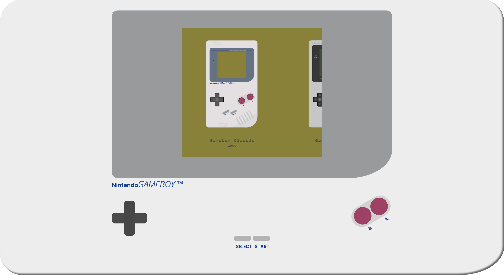

# Procesverslag
Markdown is een simpele manier om HTML te schrijven.
Markdown cheat cheet: [Hulp bij het schrijven van Markdown](https://github.com/adam-p/markdown-here/wiki/Markdown-Cheatsheet).

Nb. De standaardstructuur en de spartaanse opmaak van de README.md zijn helemaal prima. Het gaat om de inhoud van je procesverslag. Besteedt de tijd voor pracht en praal aan je website.

Nb. Door *open* toe te voegen aan een *details* element kun je deze standaard open zetten. Fijn om dat steeds voor de relevante stuk(ken) te doen.

## Jij

### Ontwerper:
Liana Boyadjian

#### Je startniveau:
Mijn startniveau is: Blauw.

# Je plan

  
De eerste versie/schets van je ontwerp & je persoonlijke uitdaging

  ### De eerste versie/schets:
  

  ### Je ambitie:
  Aan deze technieken/punten wil ik werken:
  - Leren animaties te maken in css
  - Css termen beter onder de knie krijgen
  - Meer inspiratie opdoen door bij medestudenten mee te kijken
  - Sneller om hulp vragen als het niet lukt, om te voorkomen dat ik vastloop!!

## Voortgang/Feedback 1

  
Mijn bevindingen + wijzigingen (minimaal 5)

  ### Bevinding 1:
  Mijn teksten in het scherm van de gameboy hadden nog niet voldoende contrast met de achtergrond.

  #### oplossing:
  Met de colorpicker aan de gang gegaan, net zo lang tot het contrast hoog genoeg was.

  ### Bevinding 2:
  Mijn kruisje buttons hadden nog geen hover/active state.

  #### oplossing:
  Op internet opgezocht hoe ik deze toe kon voegen en met een box-shadow generator de goede kleuren aangepast.

  ### Bevinding 3:
  Nog geen commentaar toegevoegd aan de css en html die ik heb geschreven.

  #### oplossing:
  Stel ik nog even uit tot ik meer code heb geschreven om een duidelijk overzicht te creeren.

  ### Bevinding 4:
  Nog geen animaties/hovers/spannende dingen toegevoegd.

  ### oplossing:
  Inspiratie opdoen op internet over gameboys en bij klasgenoten.

  ### Bevinding 5:
  Nog niet alle illustraties af van de verschillende type gameboys.

  ### oplossing:
  Een paar uur extra de tijd nemen om de gameboys te bestuderen en de illustraties af te maken.

## Voortgang/Feedback 2

  
Mijn bevindingen + wijzigingen (minimaal 5)

  ### Bevinding 1:
  De 'select' en 'start' buttons toegevoegd, omdat ik die vergeten was, maar het lukte niet om ze schuin te krijgen.

  #### oplossing:
  Nog een paar dingen geprobeerd, maar wilde eerst verder met andere aanpassingen omdat het te veel tijd kostte.

  ### Bevinding 2:
  De button B en A stonden nog recht naast elkaar en hadden nog geen achtergrond.

  #### oplossing:
  Met behulp van een klasgenoot alle buttons in een wrapper gezet om ze op deze manier in een grid te zetten op de gameboy. Op deze manier kon ik deze buttons los van elkaar op een andere hoogte zetten.

  ### Bevinding 3:
  De rest van mijn buttons waren nog niet gestyled.

  ### oplossing:
  De a en b buttons en de select en start buttons gestyled op dezelfde manier als de het kruisje.

  ### Bevinding 4:
  Vergeten de B en A ook daadwerkelijk onder de buttons neer te zetten als tekst.

  ### oplossing:
  Een p aangemaakt in de html om deze onder de buttons te positioneren in de css. Daarna gestyled met het lettertype en de kleur.

  ### Bevinding 5:
  Het Nintendo Gameboy logo onder de omlijning nog niet gestyled in css.

  ### oplossing:
  De goede lettertypes, of vergelijkbare daarvan, opgezocht op google en deze toegevoegd in de html en css.

## Voortgang/Feedback 3

  
Mijn bevindingen + wijzigingen (minimaal 5)

  ### Bevinding 1:
  Nog geen animatie toegevoegd.

  #### oplossing:
  Animatie toegevoegd aan de afbeeldingen. De afbeeldingen bouncen nu door middel van een hover. Hulp gehad van een eerder project dat ik heb gedaan en een klasgenoot.

  ### Bevinding 2:
  De link terug naar de index werkte wel al in de infotekst. Maar was nog niet 'leuk' genoeg.

  #### oplossing:
  Een hover toegevoegd met invert colors om het gameboy effect na te bootsen.

  ### Bevinding 3:
  Ik vond zelf dat de buttons van de gameboy wel iets moesten kunnen, maar wist nog niet wat.

  ### oplossing:
  Ben gaan googlen en kwam de gameboy classic in een paar andere kleuren tegen. Dit wilde ik verwerken, dus heb ik het gedaan met de A een B buttons. De gameboy wordt dan geel met zwart ipv de classic kleuren.

  ### Bevinding 4:
  Kwam erachter dat al mijn linkjes van de verschillende gameboy infoteksten, los in de map stonden.

  ### oplossing:
  Een 'links' map aangemaakt om hier alle linkjes in te stoppen. Daarna alle bestanden aan moeten passen zodat ze naar de goede map werden geleid. Maar wel een stuk overzichtelijker document nu! :)

  ### Bevinding 5:
  Ik had alleen voor de eerste twee gameboys een infotekst aangemaakt.

  ### oplossing:
  Op wikipedia en andere sites meer info gaan zoeken over de laatste paar gameboys en deze aan de links toegevoegd.

## Reflectie

  
Mijn eindresultaat & persoonlijke ontwikkeling

  ### Je uitkomst - karakteristiek screenshot(s):
  

  

  

  

  ### Dit ging goed/Heb ik geleerd:
  Ik heb geleerd deze animatie toe te voegen: namelijk de bounce. Als de gebruiker hoverd over de afbeeldingen, stuitert deze.

  

  ### Dit was lastig/Is niet gelukt:
  Het is uiteindelijk niet meer gelukt om de buttons select en start schuin te krijgen zoals op de originele gameboy classic. Ik heb meer tijd in andere dingen gestopt en om heel eerlijk te zijn vind ik het ook niet storend. De gameboy die daarna komt heeft ook rechte buttons.

  

## Bronnenlijst

continu bijhouden terwijl je werkt

Nb. Wees specifiek ('css-tricks' als bron is bijv. niet specifiek genoeg).

1. https://html-css-js.com/css/generator/box-shadow/
^ schaduw buttons

2. https://codepen.io/halink0803/pen/qdVXqm
^ animatie hover

3. https://www.w3schools.com/css/css3_shadows.asp
^ schaduw effect tekst, uiteindelijk niet gebruikt

4. https://www.w3schools.com/css/css_grid.asp
^ om het grid van de buttons te begrijpen

5. https://www.tutorialspoint.com/How-to-use-an-image-as-a-link-in-HTML
^ om op te frissen hoe a href ook alweer werkte

6. https://gathering.tweakers.net/forum/list_messages/1357934
^ hoe linken binnen/buiten mappen ging

7. https://blog.thibaultjanbeyer.com/using-css-filter-css-animation-on-images/
^ om css filter op afbeeldingen te maken, uiteindelijk niet gebruikt

8. https://www.w3schools.com/cssref/css3_pr_animation-duration.asp
^ om op te zoeken wat animation duration betekent

9. https://blog.hubspot.com/website/animation-iteration-count#:~:text=A%20numeric%20value%20for%20animation,animation%20to%20cycle%20three%20times.
^ om op te zoeken wat animation iteration count betekent

10. https://www.w3schools.com/css/css3_animations.asp
^ meer animatie uitleg

11. https://developer.mozilla.org/en-US/docs/Web/CSS/@keyframes
^ meer uitleg over keyframes

12. https://nl.wikipedia.org/wiki/Game_Boy
^ Wikipedia voor de info over de verschillende gameboys.

13. https://www.w3schools.com/tags/ref_pxtoemconversion.asp
^ pixels naar em om alle px weg te halen

14. https://www.w3schools.com/css/css_border.asp
^ css border opties bekijken voor de select en start buttons

15. https://codepen.io/shooft/pen/dydZYRB
^ opzet javascript geel maken van Sanne

